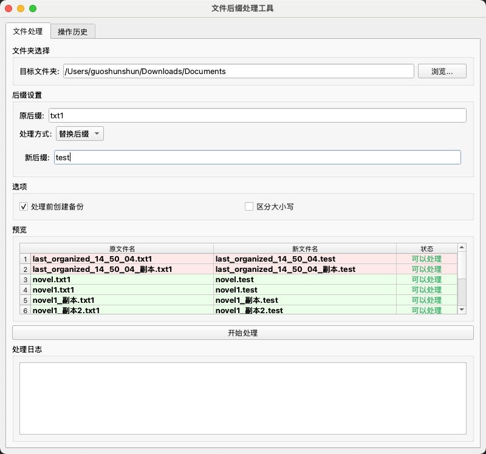
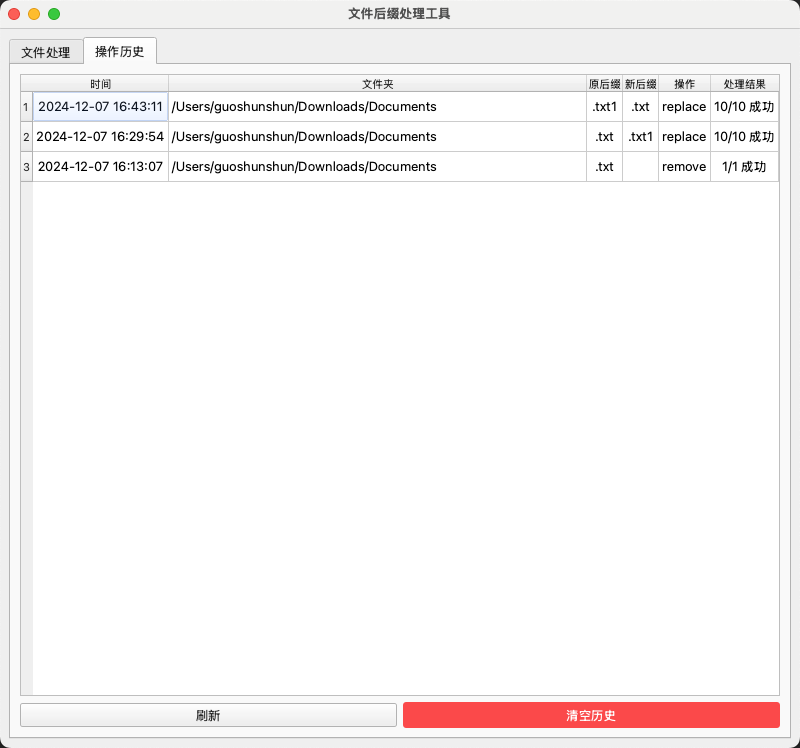
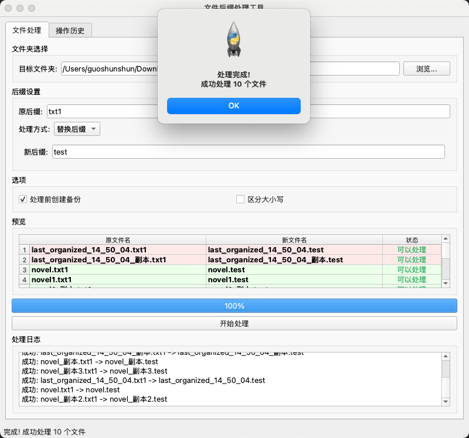

# 文件重命名工具

一个简单的文件批量重命名工具，支持保存重命名历史记录。





## 功能特点

- 批量重命名文件
- 保存重命名历史记录
- 支持撤销重命名操作

## 安装说明

### 方式一：直接运行 Python 脚本

1. 安装依赖：
```bash
pip install -r requirements.txt

```
## 使用方法

1. 运行程序:
```bash
python rename_files.py
```

2. 在程序界面中:
   - 点击"浏览..."选择要处理的文件夹，或直接输入路径
   - 输入要处理的原文件后缀（例如：.pdf）
   - 选择处理方式：
     * 移除后缀：直接删除指定的后缀（如 file.pdf → file）
     * 替换后缀：将原后缀替换为新的后缀（如 file.pdf → file.txt）
   - 如果选择替换后缀，输入新后缀
   - 预览区域会自动显示变更效果
   - 确认无误后点击"开始处理"按钮
   - 在日志区域查看处理进度和结果

3. 高级选项:
   - 勾选"处理前创建备份"可自动备份原始文件
   - 勾选"区分大小写"可进行大小写敏感的后缀匹配
   - 在"操作历史"标签页查看历史记录

## 打包说明

### 环境准备

1. 安装打包工具：
```bash
pip install -r requirements.txt
```

2. 安装跨平台依赖：

在 macOS 上打包 Windows 程序：
```bash
# 安装 Wine（用于在 macOS 上运行 Windows 程序）
brew install wine
# 安装 Windows 交叉编译工具
brew install mingw-w64

在 Windows 上打包 macOS 程序：
```bash
# 目前 Windows 上无法直接打包 macOS 程序
# 建议使用虚拟机或 CI/CD 服务
```

### 打包命令

1. 本地打包：
```bash
# 使用配置文件打包
pyinstaller rename_files.spec

# 或使用命令行参数打包
pyinstaller --name="文件后缀处理工具" --windowed --noconfirm rename_files.py
```

2. 跨平台打包：

在 macOS 上打包 Windows 程序：
```bash
# 使用 Wine 环境
WINEPREFIX=~/.wine64 WINEARCH=win64 wine pyinstaller --name="文件后缀处理工具" --windowed --noconfirm rename_files.py

# 或使用配置文件（推荐）
WINEPREFIX=~/.wine64 WINEARCH=win64 wine pyinstaller rename_files.spec
```

### 打包输出

打包后的文件位置：
- macOS: `dist/文件后缀处理工具.app`
- Windows: `dist/文件后缀处理工具.exe`

### 特别说明

1. macOS 打包注意事项：
   - 需要对应用进行签名：
     ```bash
     codesign --force --deep --sign - "dist/文件后缀处理工具.app"
     ```
   - 如果使用 Apple Silicon 芯片，建议添加 `--target-arch universal2` 参数

2. Windows 打包注意事项：
   - 如需添加图标，准备 .ico 文件并在 spec 文件中指定
   - 建议使用 UPX 压缩可执行文件大小

3. 跨平台打包限制：
   - macOS 上可以打包 Windows 程序，但需要 Wine 环境
   - Windows 上目前无法直接打包 macOS 程序
   - 建议在目标平台上进行打包以获得最佳兼容性

## 注意事项

- 后缀名可以带点号（.pdf）也可以不带点号（pdf），程序会自动处理
- 后缀名匹配默认不区分大小写
- 如果目标文件名已存在，该文件将被跳过
- 预览会随着输入自动更新，方便确认变更
- 重要文件建议开启自动备份功能
```

```